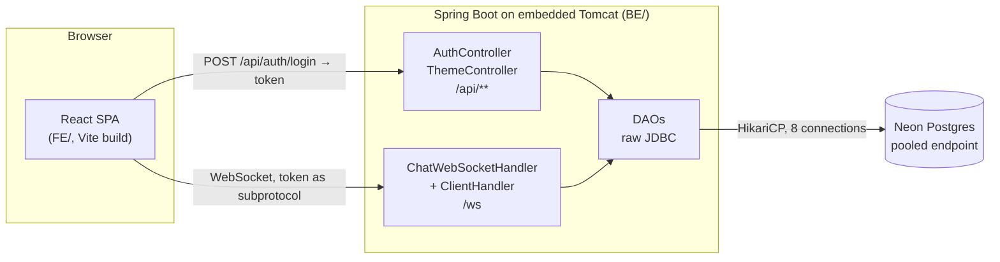
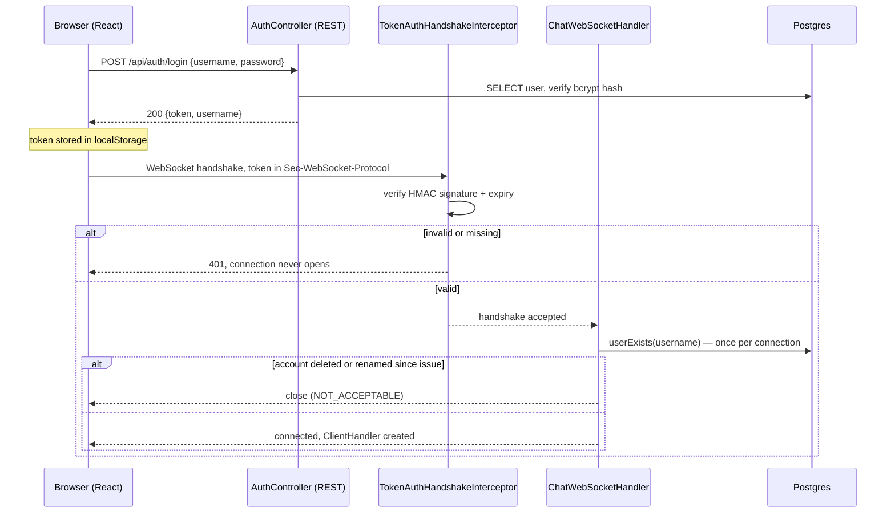
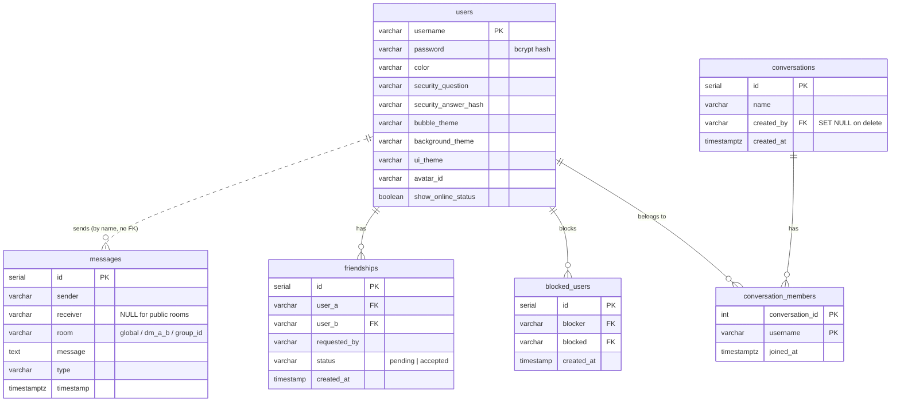
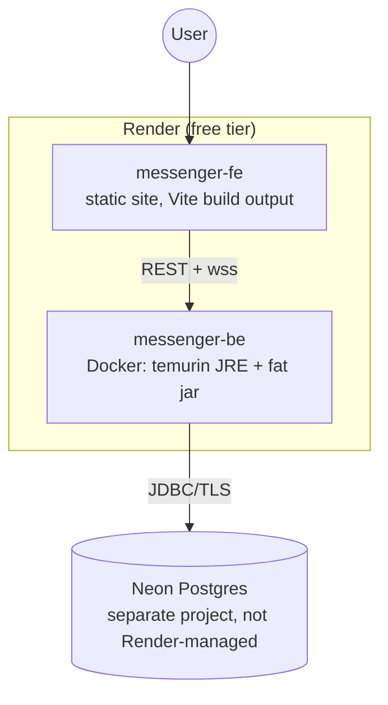

# Architecture

A three-piece system: a React single-page app in the browser, a Spring Boot
server, and a Postgres database hosted on Neon. The browser talks to the
server over **two** channels — plain REST for authentication, a WebSocket
for everything else — and that split is the single most important thing to
understand about this app.

## Why auth is REST and chat is WebSocket

The original JavaFX app (`legacy/`) did everything over one socket: you
opened it, sent `AUTH_LOGIN|user|pass`, and parsed a pipe-delimited string
back. That's awkward from a browser — you can't see it in the network tab
like a normal request, and every auth failure mode has to be invented on
top of a raw socket instead of being an HTTP status code.

So authentication moved to `POST /api/auth/{register,login,reset/question,
reset/verify}`, and the WebSocket became chat-only. The socket doesn't have
a pre-auth phase at all anymore: `TokenAuthHandshakeInterceptor` rejects the
*handshake itself* with `401` unless a valid token is present, which means
every `ClientHandler` that exists is, by construction, already
authenticated. The full contract is in
[`BE/README.md`](../BE/README.md#auth-rest-not-websocket).

This is also the project's biggest **breaking change vs. `legacy/`** — the
old JavaFX client cannot be pointed at this backend and made to work.

## How a session starts

Two design points worth knowing, both explained in full in
[`BE/README.md`](../BE/README.md):

- **The token is stateless** (HMAC-SHA256, 24h expiry, no session table), so
  it can't know the account was deleted or renamed after it was issued. One
  `userExists` query *per connection* — not per message — closes that gap
  cheaply.
- **The token rides in the `Sec-WebSocket-Protocol` header**, not in a
  `?token=` query parameter, because query strings are what proxy and server
  access logs record by default.

## How messages travel

Every chat message, in both directions, is one JSON `Message` object — the
same shape `legacy/` used, serialized by Gson. The client sends a `type`
(`message`, `dm`, `create_group`, `add_friend`, `set_theme`, …), and
`ClientHandler` switches on it.

Rooms are identified by a **room key**:

| Room key | Meaning | Backed by |
|---|---|---|
| `global` | the public room everyone shares | nothing — a string |
| `dm_<a>_<b>` | a DM, usernames sorted alphabetically | nothing — a string convention |
| `group_<id>` | a group chat | a real `conversations` row |

The difference in that last column matters. DMs are a *convention*: any two
usernames imply a room key, and there's no row anywhere asserting that a
conversation exists. That can't work for N people, so groups are persisted
(`conversations` + `conversation_members`), which makes group authorization
a real membership query rather than a string the client could have made up.
See [`BE/README.md`](../BE/README.md#group-chats).

Delivery differs too:

- **Global and DM messages** go out through `broadcastToRoom`, which reaches
  the clients whose current room matches.
- **Group messages fan out directly to every online member**, whatever room
  they're looking at right now — otherwise a member sitting in a different
  chat would never get the message, and their unread badge would never
  light up.

Everything is persisted to `messages` first, so history survives a reload
regardless of who was online at the time.

## Data model

Two things the diagram can't show on its own:

- **`messages` has no foreign keys.** `sender`/`receiver`/`room` are plain
  text (dotted line above). That's what lets a deleted account's history
  survive for the other participant — and it's also why deleting a group has
  to delete its messages explicitly, since no cascade reaches them. Both are
  deliberate; see the "Known limitation" sections in
  [`BE/README.md`](../BE/README.md).
- **`conversation_members` is all key.** Both of its columns are the
  composite primary key *and* foreign keys (to `conversations` and `users`
  respectively), which mermaid can't show as one marker — the `PK` above is
  doing double duty.
- **Everything else cascades on rename.** The FKs are
  `ON UPDATE CASCADE`, and `UserDAO.changeUsername` additionally rewrites
  the non-FK columns (`messages.sender/receiver/room`,
  `friendships.requested_by`) inside one transaction.

`schema.sql` is the final-state schema for a fresh database; existing
databases get the incremental files in
`BE/src/main/resources/migrations/`, applied by hand in filename order.

## What runs where in production

Both services come from [`render.yaml`](../render.yaml) as a Blueprint. Two
consequences of the free tier that are easy to mistake for bugs:

- **The backend spins down after ~15 minutes idle.** The first request after
  that takes 30-50s while it wakes up, and the WebSocket won't connect until
  it's up.
- **The database is not Render's.** It's a separately managed Neon project,
  and its connection string must use the *pooled* endpoint with
  `prepareThreshold=0` — Neon's pooler is PgBouncer in transaction mode,
  which doesn't reliably support the server-side prepared statements the
  pgJDBC driver starts using after 5 executions of the same query. Getting
  this wrong fails minutes into operation, not at startup.

`TRUST_PROXY_HEADERS=true` is set in production and must stay off locally:
it tells the app to trust `X-Forwarded-For` for client-IP resolution, which
is correct behind exactly one trusted proxy hop (Render) and a way to forge
your IP on every request anywhere else.

## Repository layout

| Path | Role |
|---|---|
| [`FE/`](../FE/README.md) | React + Vite client — the UI going forward |
| [`BE/`](../BE/README.md) | Spring Boot server — WebSocket + REST auth |
| [`legacy/`](../legacy/README.md) | The original JavaFX desktop app + Java-WebSocket server. Archived, still buildable, **not** deployed. Don't add features here |
| [`docs/`](README.md) | This documentation |
| [`render.yaml`](../render.yaml) | Render Blueprint for both services |
| [`.github/workflows/be-ci.yml`](../.github/workflows/be-ci.yml) | CI: the only place the Testcontainers integration tests actually run |

## The rewrite, in one paragraph

`legacy/` works, but it only runs as a local desktop app — it can't be
deployed and opened like a normal website. The server-side logic (WebSocket
handling, auth, DAOs, schema) was largely reusable; the JavaFX UI was not.
So the server was ported to Spring Boot and the UI rebuilt in React, with
auth deliberately re-designed along the way. Group chats are the one feature
that exists here and never existed in `legacy/` at all.
